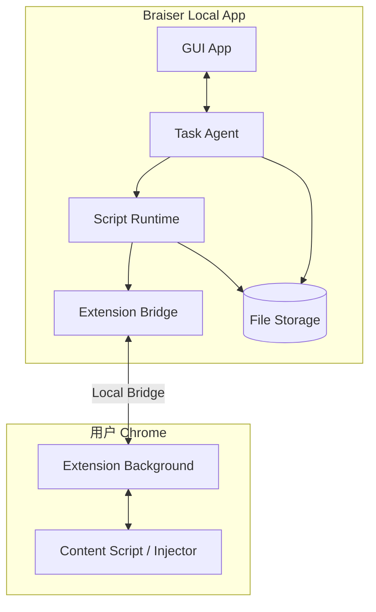

# 架构与执行流

## 组件职责

| 组件 | 职责 |
|---|---|
| 本地 App | GUI、任务编排、脚本执行、插件通信、基础日志/脚本持久化 |
| Chrome 插件 | 页面快照、元素定位、浏览器动作执行 |
| LLM | 根据用户任务和页面快照生成 playwright-like 脚本 |
| 本地文件存储 | 保存任务记录、基础事件、最终脚本、页面快照和配置 |

## 系统架构图



## 任务执行流

```text
用户在本地 App 输入任务
-> 插件采集页面快照
-> Task Agent 组装 Prompt（任务 + 快照 + API 约束）
-> Task Agent 调用 LLM 生成完整脚本
-> Script Runtime 执行脚本
-> Script Runtime 把 page/locator 调用转为浏览器动作
-> 插件执行动作并返回结果/快照
-> 本地 App 保存基础任务日志和最终脚本
```

## Runtime 调用路径

```text
page.getByRole(...).click()
-> Script Runtime
-> BrowserCommand
-> Extension Bridge
-> Local Bridge
-> Chrome Extension
-> 页面动作 + 新快照
-> 任务日志
```

Braiser 的 Playwright-style API 是语义接口，不绑定原版 Playwright，也不要求用户 Chrome 暴露 CDP 端口。


